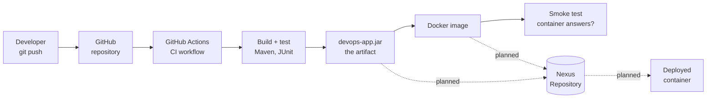

# DevOps CI/CD Pipeline with Artifact Management (Nexus)

A college DevOps lab project. It demonstrates a complete **software delivery pipeline**: an automated sequence of steps that takes source code from a `git push` to a running, tested application. Every built version is stored in an **artifact repository** (Sonatype Nexus) so that any version can be redeployed later without rebuilding it.

The application itself is deliberately small (a to-do list REST API). The subject of the project is the pipeline that builds, tests, packages, stores and deploys it.

## The pipeline at a glance



Solid arrows are implemented and running on every push. Dotted arrows are the Nexus stages that are designed but not built yet.

## Assignment requirements and where each one is met

| Requirement | Where | Status |
|---|---|---|
| Version control (Git/GitHub) | This repository | Done |
| Application build | `app/` with Maven (`./mvnw verify`) | Done |
| Automated testing | 13 JUnit tests in `app/src/test` | Done |
| Containerization (Docker) | `app/Dockerfile` | Done |
| CI/CD pipeline | `.github/workflows/ci.yml` (GitHub Actions) | CI done, release/deploy planned |
| Artifact management (Nexus) | `infra/nexus/` setup + Maven publishing config, verified in CI by `nexus-setup-test.yml` | Setup done, host machine pending |
| Deployment | Container deployed from an image stored in Nexus | Planned |
| Documentation + demo | `README.md`, `docs/` | In progress |

## Documentation

| Document | Purpose |
|---|---|
| [`docs/ARCHITECTURE.md`](docs/ARCHITECTURE.md) | How the project works: concepts, components, and diagrams of every flow |
| [`docs/SETUP.md`](docs/SETUP.md) | Step-by-step setup of the machine that hosts Nexus, the runner and the deployed app |
| [`docs/HANDOFF.md`](docs/HANDOFF.md) | Current state, fixed names and settings, environment facts, and remaining work, for anyone (or any AI assistant) continuing the project |

## Repository layout

```
.github/workflows/
  ci.yml                   CI pipeline, runs on GitHub's cloud runners
  nexus-setup-test.yml     Tests infra/nexus + publishing on a throwaway Nexus
app/                       Spring Boot application (Java 21, Maven)
  pom.xml                  Build definition: name, version, dependencies, Nexus URLs
  ci-settings.xml          Nexus credentials for Maven, read from environment variables
  Dockerfile               Runtime image built from an already-built jar
  src/main/...             Task API and /api/version endpoint
  src/test/...             Unit tests and API tests
infra/nexus/               Nexus: docker-compose.yml, setup-nexus.sh, .env.example
docs/                      Architecture, setup and hand-off documentation
AGENTS.md                  Context file loaded automatically by AI coding assistants
```

## The application

| Endpoint | Purpose |
|---|---|
| `GET /api/tasks` | List tasks |
| `POST /api/tasks` with `{"title": "..."}` | Create a task. A blank title is rejected with HTTP 400. |
| `GET /api/tasks/{id}` | Get one task, or HTTP 404 if it does not exist |
| `PATCH /api/tasks/{id}/complete` | Mark a task done |
| `DELETE /api/tasks/{id}` | Delete a task |
| `GET /api/version` | Name, version and build time of the running build, which shows which version is deployed |
| `GET /actuator/health` | `{"status":"UP"}` when the app is running, used by the smoke test and the Docker health check |

Tasks are held in memory and reset when the app restarts. This is intentional, because the app exists to be delivered by the pipeline.

## Running it locally

Requires JDK 21. Maven does not need to be installed, because the Maven wrapper (`mvnw`) downloads it.

```bash
cd app
./mvnw verify                                   # compile, run tests, build the jar
java -jar target/devops-app-1.0.0-SNAPSHOT.jar
curl localhost:8080/api/version
```

With Docker:

```bash
cd app
./mvnw verify
docker build -t devops-app:local .
docker run -p 8080:8080 devops-app:local
```

## Fixed names for the Nexus integration

The workflows and the Nexus server are configured independently. These values are shared so the two sides match:

| Item | Value |
|---|---|
| Nexus web/API URL | `http://localhost:8081` |
| Nexus Docker registry | `localhost:8082` |
| Maven repositories | `maven-releases`, `maven-snapshots` |
| Docker repository | `docker-hosted` |
| Image name | `devops-app` |
| GitHub Secrets | `NEXUS_USER`, `NEXUS_PASSWORD` |
| Self-hosted runner labels | `self-hosted`, `nexus` |
