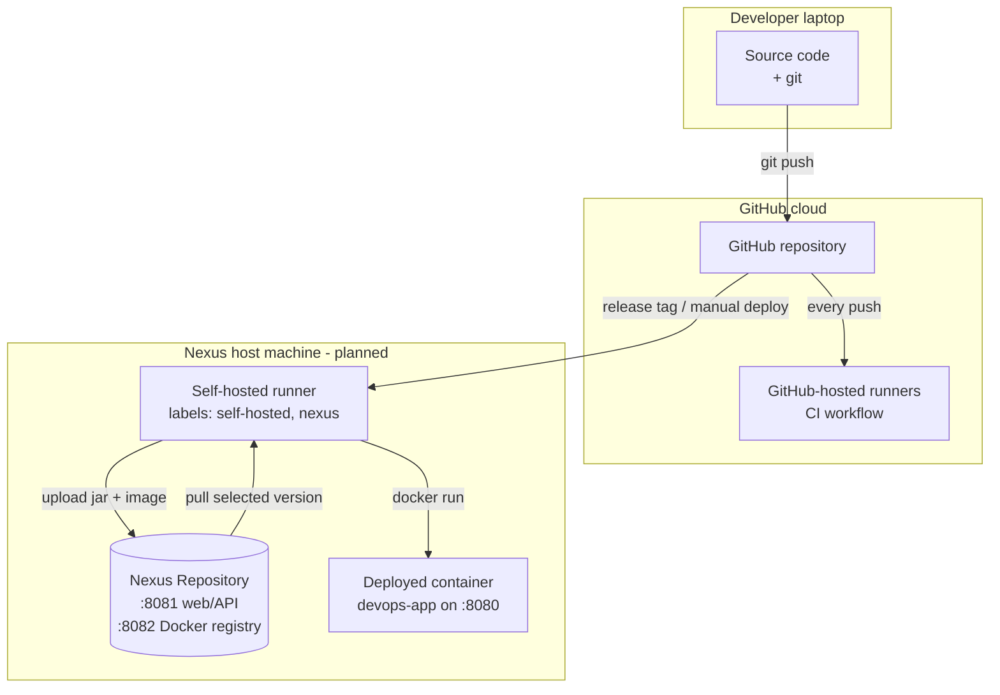
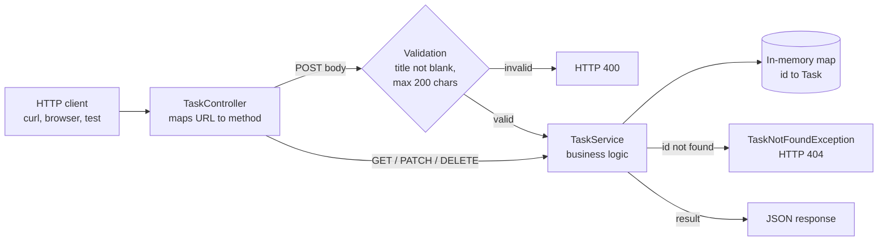
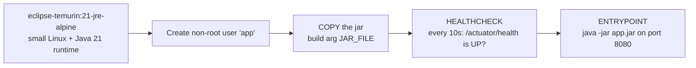
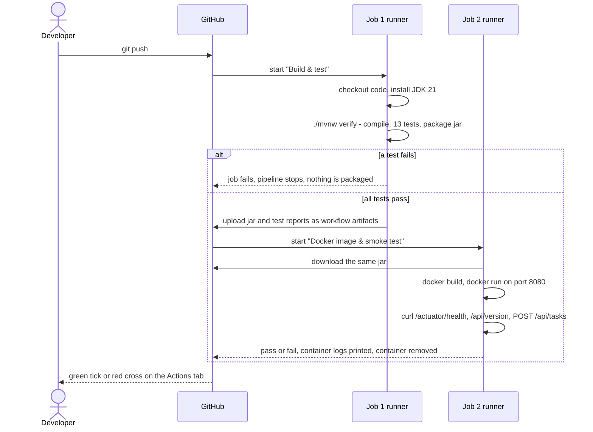
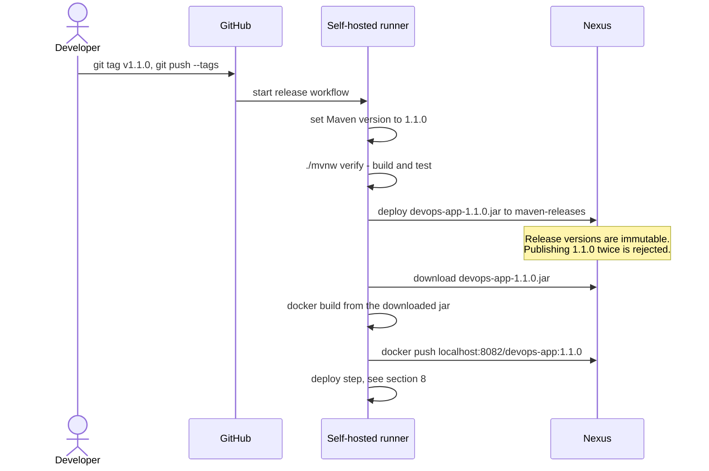
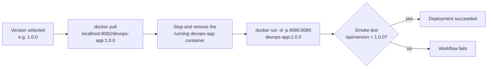
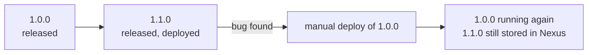

# Architecture

How the project works, from the concepts it is built on to the exact sequence of steps in each pipeline. Diagrams are in Mermaid, which GitHub renders automatically.

Each section is marked **Implemented** (exists and runs) or **Planned** (designed, not built yet).

---

## 1. Concepts

| Term | Meaning in this project |
|---|---|
| **Pipeline** | An automated sequence of steps that turns source code into a running application, stopping as soon as any step fails. |
| **CI (Continuous Integration)** | Building and testing the code automatically on every push, so problems are found immediately. |
| **CD (Continuous Delivery/Deployment)** | Automatically packaging, storing and deploying versions that passed CI. |
| **Artifact** | The output of a build. Here, the file `devops-app-<version>.jar` and the Docker image `devops-app:<version>`. |
| **Artifact repository** | A server that stores artifacts by name and version, so they can be downloaded and reused. This project uses **Sonatype Nexus Repository**. |
| **SNAPSHOT version** | A work-in-progress version such as `1.0.0-SNAPSHOT`. Nexus allows it to be overwritten by newer builds. |
| **Release version** | A final version such as `1.0.0`. Nexus refuses to overwrite it, so a release is permanent and reproducible. |
| **Maven** | The Java build tool. It reads `pom.xml`, downloads libraries, compiles, runs tests and packages the jar. |
| **Maven wrapper (`mvnw`)** | A script in the repo that downloads the correct Maven version automatically, so Maven does not need to be installed. |
| **Jar** | A single Java archive file containing the compiled app and all its libraries. Run with `java -jar`. |
| **Docker image** | A sealed package containing an operating system layer, Java and the jar. It runs identically on any machine with Docker. |
| **Container** | A running instance of a Docker image. |
| **GitHub Actions** | GitHub's automation service. It runs the steps defined in `.github/workflows/*.yml` files. |
| **Workflow / job / step** | A workflow is one YAML file. It contains jobs, and each job runs on a fresh machine and contains steps (commands). |
| **Runner** | The machine that executes a job. *GitHub-hosted* runners are temporary cloud machines. A *self-hosted* runner is a program installed on one's own machine. |
| **Smoke test** | A quick check after starting the app: does it start and answer basic requests? |
| **Rollback** | Redeploying an older version after a problem is found in a newer one. |

---

## 2. System overview

Three locations are involved: GitHub's cloud, the developer's laptop, and the machine that hosts Nexus.



**Why two kinds of runner:** GitHub-hosted runners live on the internet and cannot reach a Nexus server running on a private machine (`localhost:8081` there means the cloud machine itself). Steps that need Nexus therefore run on a self-hosted runner installed on the same machine as Nexus. Steps that do not need Nexus (build, test, Docker smoke test) run in GitHub's cloud and use no local resources.

---

## 3. The application - Implemented

A Spring Boot REST API. Spring Boot is a Java framework that starts an embedded web server and routes HTTP requests to Java methods.

### How a request is handled



### Source files

| File | Role |
|---|---|
| `DevopsAppApplication.java` | Entry point that starts Spring Boot. |
| `task/Task.java` | The data shape of a task: `id`, `title`, `done`, `createdAt`. |
| `task/CreateTaskRequest.java` | The accepted input for creating a task, with validation rules. |
| `task/TaskController.java` | Maps URLs (`/api/tasks/...`) to service calls and sets HTTP status codes (201 Created, 204 No Content). |
| `task/TaskService.java` | Stores tasks in a thread-safe in-memory map and implements create/find/complete/delete. |
| `task/TaskNotFoundException.java` | Signals a missing task. Spring turns it into HTTP 404. |
| `version/VersionController.java` | `GET /api/version`. Reads `META-INF/build-info.properties`, a file Maven generates at build time containing the name, version and build time. |
| `resources/application.properties` | Configuration. Exposes `/actuator/health` and `/actuator/info`. |

### Why `/api/version` matters

The version is written into the jar by Maven during the build (the `build-info` goal in `pom.xml`). The running app reports it, so after any deployment or rollback a single request shows exactly which artifact is live:

```
GET /api/version  ->  {"name":"devops-app","version":"1.0.0-SNAPSHOT","buildTime":"2026-10-09T04:38:25Z"}
```

---

## 4. Tests - Implemented

13 automated tests, run by `./mvnw verify`. A single failure stops the pipeline.

| Test class | Kind | What it checks |
|---|---|---|
| `TaskServiceTest` (5) | Unit test: plain Java, no web server | IDs increment, titles are trimmed, list order, completing, deleting, missing IDs throw an error |
| `TaskControllerTest` (6) | API test: Spring MockMvc sends simulated HTTP requests to the controller | Status codes (201, 200, 204, 400, 404), JSON fields, `Location` header, blank title rejected |
| `DevopsAppApplicationTests` (2) | Full application test: starts the whole app | `/actuator/health` reports `UP`, `/api/version` reports a real version |

---

## 5. Docker image - Implemented

`app/Dockerfile` does **not** compile code. It only packages a jar that was already built and tested:



Separating "build the jar" from "package the jar" is deliberate: the image is guaranteed to contain the exact file that passed the tests, and later the exact file stored in Nexus. `.dockerignore` limits what Docker can see to `target/*.jar`.

---

## 6. CI workflow - Implemented

File: `.github/workflows/ci.yml`. Trigger: every push to any branch, and every pull request to `main`. Runs on GitHub-hosted Ubuntu runners.



The jar and test reports remain downloadable from the run's page on GitHub (the "Artifacts" section).

---

## 7. Release workflow - Planned

Trigger: pushing a git tag such as `v1.1.0`. Runs on the self-hosted runner next to Nexus.



The jar is downloaded back from Nexus before the image is built. This demonstrates the core idea of artifact management: **build once, store, and deploy the stored artifact**, rather than rebuilding for each deployment.

Pushes to `main` without a tag are intended to publish `1.0.0-SNAPSHOT`-style builds to `maven-snapshots`, which Nexus allows to be overwritten.

---

## 8. Deployment and rollback - Planned

One deployment procedure, used both at the end of a release and on demand (a manual "deploy" workflow with a version number as input):



**Rollback** is the same procedure with an older version number. Nothing is rebuilt: the old image is fetched from Nexus, so it is byte-for-byte the version that was originally tested and released.

### Version lifecycle in Nexus



---

## 9. Security and configuration notes

- Nexus credentials are never stored in the repository. Workflows read them from the GitHub Secrets `NEXUS_USER` and `NEXUS_PASSWORD`.
- The container runs as a non-root user.
- The Nexus Docker registry uses plain HTTP on `localhost:8082`. Docker allows unencrypted registries on `localhost` by default. A registry on any other address would need HTTPS or an `insecure-registries` entry in the Docker daemon settings.
