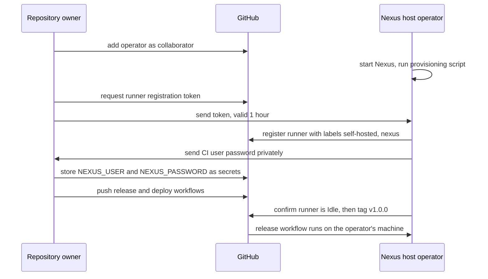

# Project Hand-off: Current State and Remaining Work

This document describes the project's state precisely enough for a person, or an AI assistant acting for them, to continue the work without access to earlier conversations. It records facts, agreed names and settings, and the shape of the remaining work. For how the system works, see [`ARCHITECTURE.md`](ARCHITECTURE.md).

Last updated: 2026-10-09.

---

## 1. Project context

- **Purpose:** college DevOps lab assignment. The brief requires version control (Git/GitHub), an application build, automated testing, Docker containerization, a CI/CD pipeline (Jenkins or GitHub Actions), deployment, documentation, and a live demonstration of the working pipeline.
- **Chosen topic:** *Artifact Management in DevOps Using Nexus Repository*, widened into a full CI/CD pipeline in which Nexus stores every released version and deployments pull from Nexus.
- **Repository:** https://github.com/manaymehta/devops-nexus-pipeline (public, default branch `main`).
- **Work split:**
  - The repository owner's laptop (7.4 GB RAM) handles the application, tests, Dockerfile, workflows and documentation.
  - A second machine, operated by another person, hosts the memory-heavy parts: the Nexus server, the GitHub Actions self-hosted runner, and the deployed container.
  - The live demo runs against the second machine.

---

## 2. What exists and is verified

| Item | State | Evidence |
|---|---|---|
| Spring Boot app in `app/` | Complete | Builds with `./mvnw verify` and serves all endpoints when run with `java -jar` |
| Tests | 13 tests, all passing | Local build and CI run |
| `app/Dockerfile` | Complete | Image built and smoke-tested in CI |
| `.github/workflows/ci.yml` | Complete, green | Run `37884810619` on commit `1ed2791`: both jobs passed |
| Documentation | `README.md`, `docs/ARCHITECTURE.md`, this file | - |
| Nexus server | Not set up | - |
| Self-hosted runner | Not set up | - |
| Release, deploy and rollback workflows | Not written | - |
| Maven publishing configuration in `pom.xml` | Not added | - |
| Project report and screenshots | Not started | - |

---

## 3. Technical facts about the codebase

- **Stack:** Java 21, Spring Boot **4.1.1**, Maven **3.9.16** through the Maven wrapper 3.3.4. Generated from start.spring.io with dependencies `webmvc`, `actuator` and `validation`.
- **Coordinates:** groupId `com.devops`, artifactId `devops-app`, current version `1.0.0-SNAPSHOT`. The built jar is `app/target/devops-app-<version>.jar`.
- **Spring Boot 4 test packages** differ from Spring Boot 3:
  - `org.springframework.boot.webmvc.test.autoconfigure.WebMvcTest`
  - `org.springframework.boot.webmvc.test.autoconfigure.AutoConfigureMockMvc`
- **Version reporting:** `spring-boot-maven-plugin` runs the `build-info` goal, which writes `META-INF/build-info.properties`. `GET /api/version` returns `"unknown"` only when the app runs without a Maven build, for example from some IDEs.
- **Test isolation:** API tests share one Spring context, so task IDs are not predictable between tests. The tests read IDs from the `Location` header instead of assuming `1`.
- **Executable bit:** `app/mvnw` is stored in git with mode `100755`. Linux runners cannot run the wrapper without it, so a file recreated on Windows needs `git add --chmod=+x app/mvnw`.
- **Line endings:** `app/.gitattributes` forces LF for `mvnw` and CRLF for `*.cmd`.
- **Dockerfile:** base image `eclipse-temurin:21-jre-alpine`. It runs as non-root user `app`, has a `HEALTHCHECK` on `/actuator/health`, and takes the jar via build argument `JAR_FILE` (default `target/*.jar`). It never compiles source.
- **GitHub Action versions in use:** `actions/checkout@v7`, `actions/setup-java@v6`, `actions/upload-artifact@v7`, `actions/download-artifact@v8`.
- **GitHub token scope:** pushing files under `.github/workflows/` requires the `workflow` OAuth scope. The owner's `gh` login has it.
- **Workspace isolation:** on the owner's machine the project folder sits inside an unrelated pnpm workspace (`D:\MANAY\MANAY\Code\Projects`). The project is intentionally not registered with that workspace in any way: not in its `.gitignore`, `pnpm-workspace.yaml` or catalog tooling.

---

## 4. Fixed names and settings

The workflows and the Nexus server are configured separately and must match on these values.

| Item | Value |
|---|---|
| Nexus web UI and REST API | `http://localhost:8081` (from the Nexus host machine) |
| Nexus Docker registry (HTTP connector on the Docker hosted repository) | `localhost:8082` |
| Maven release repository | `maven-releases`, URL `http://localhost:8081/repository/maven-releases/` |
| Maven snapshot repository | `maven-snapshots`, URL `http://localhost:8081/repository/maven-snapshots/` |
| Docker hosted repository | `docker-hosted` |
| Image name in the registry | `localhost:8082/devops-app:<version>` |
| Maven `<server>` ids for credentials | `nexus-releases`, `nexus-snapshots` |
| GitHub Actions secrets | `NEXUS_USER`, `NEXUS_PASSWORD` (a dedicated CI user, not the admin account) |
| Self-hosted runner labels | `self-hosted`, `nexus`, so jobs target it with `runs-on: [self-hosted, nexus]` |
| Deployed container | name `devops-app`, published on port `8080` |
| Version tags | `vX.Y.Z` (e.g. `v1.0.0`). The Maven/image version is the tag without the `v`. |

---

## 5. Requirements for the Nexus host machine

### Software
- Docker with Compose
- Git
- The GitHub Actions runner, registered to the repository with the labels above
- `curl`

If the host runs Windows, workflow steps written for `bash` depend on Git Bash being installed and on the runner finding `bash` on its PATH.

### Nexus
- Runs as the official `sonatype/nexus3` Docker image, with a persistent volume for `/nexus-data`.
- Ports mapped:
  - `8081`: web UI and API
  - `8082`: Docker registry connector
- The repositories `maven-releases` and `maven-snapshots` exist by default in a fresh Nexus. `docker-hosted` has to be created, with an HTTP connector on port 8082.
- `docker login` against Nexus requires the **Docker Bearer Token Realm** to be active. It is under Security, Realms.
- The initial admin password is generated in `/nexus-data/admin.password` on first start.
- A dedicated CI user is expected, with permission to read and write the three repositories.

### Memory
- Nexus defaults to a JVM heap of roughly 2.7 GB, which can be reduced.
- The `sonatype/nexus3` image accepts JVM options through the `INSTALL4J_ADD_VM_PARAMS` environment variable, for example `-Xms512m -Xmx1g -XX:MaxDirectMemorySize=1g`. This variable name comes from the image's documentation and has not yet been tested in this project.
- The current Nexus edition and version, and any limits of the free "Community Edition", have not been checked yet.

### Reachability
- GitHub-hosted runners cannot reach `localhost:8081` on the host machine. Every job that talks to Nexus runs on the self-hosted runner.
- The runner only needs outbound internet access to GitHub. No inbound ports have to be opened.

---

## 6. Remaining work

Each item lists who owns it and its expected result. Items are ordered by dependency.

Two roles are referred to:
- **Repository owner:** GitHub account `manaymehta`, on the 7.4 GB laptop.
- **Nexus host operator:** the person whose machine runs Nexus, the runner and the deployed container.

### Who does what

| Order | Item | Owner | Depends on |
|---|---|---|---|
| 1 | Collaborator access to the repository | Repository owner | - |
| 2 | Nexus running and provisioned (6.1) | Nexus host operator | 1 |
| 3 | Runner registration token handed over | Repository owner | - |
| 4 | Self-hosted runner installed and registered (6.2) | Nexus host operator | 2, 3 |
| 5 | CI user credentials stored as GitHub Secrets | Repository owner, with the password supplied by the operator | 2 |
| 6 | Maven publishing configuration (6.3) | Either | - |
| 7 | Release workflow (6.4) and deploy workflow (6.5) | Either to write. Testable only on the Nexus host | 4, 5, 6 |
| 8 | End-to-end run and screenshots (6.7) | Nexus host operator runs it, both capture screenshots | 7 |
| 9 | Report | Repository owner | 8 |

### Access constraints on a personal-account repository

These follow GitHub's documented rules for personal repositories, which have not been tested on this repository yet:

- Collaborators get write access to code, but not to repository settings.
- Adding self-hosted runners and creating Actions secrets are limited to the **repository owner**.
- A runner registration token is created by the owner, either in Settings, Actions, Runners, New self-hosted runner, or with `gh api -X POST repos/manaymehta/devops-nexus-pipeline/actions/runners/registration-token`. It expires after one hour.
- The CI user password travels from the operator to the owner outside GitHub, through a private channel, and is never committed to the repository.

### 6.1 Nexus provisioning
- **Owner:** Nexus host operator. The compose file and script can be written by either person.
- **Location:** `infra/nexus/`
  - `docker-compose.yml`: Nexus with a capped heap and a persistent volume.
  - A provisioning script that uses the Nexus REST API (`/service/rest/v1/...`) to create `docker-hosted`, activate the Docker Bearer Token Realm, and create the CI user.
- Scripting the setup keeps it reproducible and documentable, rather than relying on manual UI clicks.
- **Done when:**
  - `curl http://localhost:8081/service/rest/v1/status` answers.
  - `docker login localhost:8082` succeeds with the CI user.
  - A test image can be pushed to `localhost:8082`.

### 6.2 Self-hosted runner
- **Owner:** Nexus host operator, using a registration token from the repository owner.
- **Location:** installed outside the repository on the Nexus host, registered with labels `self-hosted, nexus`.
- **Done when:** the runner shows as "Idle" under the repository's Settings, Actions, Runners.

### 6.3 Maven publishing configuration
- **Owner:** either person.
- **In `app/pom.xml`:** a `<distributionManagement>` section pointing at the two Maven repository URLs, with ids `nexus-releases` and `nexus-snapshots`.
- **Credentials:** supplied at run time from the secrets, for example through `actions/setup-java`'s `server-id`, `server-username` and `server-password` inputs, which generate a Maven `settings.xml`.
- **Done when:** `./mvnw deploy` from the runner places the jar in Nexus.

### 6.4 Release workflow
- **Owner:** either person writes it. It can only run once the runner and secrets exist.
- **File:** `.github/workflows/release.yml`
- **Trigger:** tag push matching `v*.*.*`.
- **Job:** runs on `[self-hosted, nexus]`.
- **Sequence:**
  1. Derive the version from the tag.
  2. Set the Maven project version to it, for example with `versions:set`.
  3. `./mvnw deploy`, which builds, tests and publishes to `maven-releases`.
  4. Download that exact jar back from Nexus, through the REST API or the repository URL path `com/devops/devops-app/<v>/devops-app-<v>.jar`.
  5. `docker build --build-arg JAR_FILE=...` using the downloaded jar.
  6. `docker push localhost:8082/devops-app:<v>`.
  7. Run the deployment procedure (6.5).
- **Done when:** tagging `v1.0.0` results in the jar and image visible in Nexus and the container serving `/api/version` = `1.0.0`.
- **Expected failure:** re-running the release for an existing tag fails at the deploy step, because `maven-releases` does not allow redeploying a version. This is used as a demonstration.

### 6.5 Deploy / rollback workflow
- **Owner:** either person writes it. It can only run once the runner and secrets exist.
- **File:** `.github/workflows/deploy.yml`
- **Trigger:** `workflow_dispatch` with a `version` input. Ideally the release workflow reuses the same steps, as a reusable workflow or composite action, rather than duplicating them.
- **Sequence:**
  1. `docker login`, then `docker pull localhost:8082/devops-app:<v>`.
  2. Remove any running `devops-app` container.
  3. `docker run -d --name devops-app -p 8080:8080 ...`.
  4. Wait for `/actuator/health` = `UP`.
  5. Assert `/api/version` reports `<v>`.
- **Done when:** with `1.0.0` and `1.1.0` both released, deploying `1.0.0` makes `/api/version` report `1.0.0` without any build step running.

### 6.6 Snapshot publishing (optional extension of CI)
- **Owner:** either person.
- On pushes to `main`, a job on the self-hosted runner publishes the `-SNAPSHOT` jar to `maven-snapshots`.
- This job only succeeds while the self-hosted runner is online. The existing cloud CI jobs do not depend on it.

### 6.7 Documentation for submission
- **Owner:** the repository owner writes the report. Screenshots of Nexus and deployments come from the Nexus host.
- A project report covering:
  - introduction
  - architecture (diagrams from `ARCHITECTURE.md`)
  - tools and why each was chosen
  - each pipeline stage
  - Nexus concepts
  - challenges, including the RAM constraint that led to the two-machine split and the choice of a GitHub Actions self-hosted runner over Jenkins
  - conclusion
- **Screenshots:**
  - a green CI run
  - a red CI run caused by a failing test
  - the Nexus browse view showing several versions
  - the Docker registry contents
  - `/api/version` before and after a rollback
  - the rejected re-release

---

## 7. Demo scenario the work is aiming at

1. `/api/version` shows `1.0.0` running.
2. A code change is pushed and tagged `v1.1.0`. The release workflow runs live, and `1.1.0` appears in Nexus and is deployed.
3. A deliberately broken test is pushed. CI turns red, and nothing reaches Nexus.
4. The `v1.1.0` release is re-run. Nexus rejects the duplicate release version.
5. The deploy workflow is run with `1.0.0`. The old version is pulled from Nexus and running again with no rebuild.
6. A specific jar version is downloaded from Nexus with `curl` and run with `java -jar`, showing the artifact is reusable outside Docker.

---

## 8. Open questions

- The operating system and free RAM of the Nexus host machine.
- Whether the faculty accepts a local deployment, or expects a cloud server such as AWS EC2.
- Whether the faculty requires Jenkins specifically. GitHub Actions was chosen because Jenkins needs more memory.
- Optional extras not yet accepted or rejected:
  - JaCoCo test-coverage report
  - deployment to a cloud VM
  - Nexus cleanup policies for old snapshots
