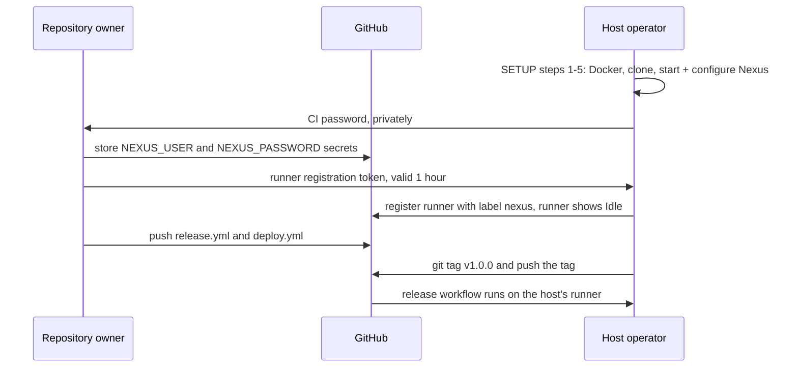

# Project Hand-off: Current State and Remaining Work

This document describes the project's state precisely enough for a person, or an AI assistant acting for them, to continue the work without access to earlier conversations. It records facts, agreed names and settings, and the shape of the remaining work.

- How the system works: [`ARCHITECTURE.md`](ARCHITECTURE.md).
- Step-by-step preparation of the Nexus host machine: [`SETUP.md`](SETUP.md).

Last updated: 2026-10-09.

---

## 1. Project context

- **Purpose:** college DevOps lab assignment. The brief requires version control (Git/GitHub), an application build, automated testing, Docker containerization, a CI/CD pipeline (Jenkins or GitHub Actions), deployment, documentation, and a live demonstration of the working pipeline.
- **Chosen topic:** *Artifact Management in DevOps Using Nexus Repository*, widened into a full CI/CD pipeline in which Nexus stores every released version and deployments pull from Nexus.
- **Repository:** https://github.com/manaymehta/devops-nexus-pipeline (public, default branch `main`). Ownership may be transferred to the person continuing the work. GitHub then redirects this URL to the new one.
- **Work split:**
  - The project was started on a 7.4 GB RAM laptop, which cannot host Nexus.
  - The person continuing the work hosts the memory-heavy parts on their machine: the Nexus server, the GitHub Actions self-hosted runner, and the deployed container.
  - The live demo runs on that machine.

---

## 2. What exists and is verified

| Item | State | Evidence |
|---|---|---|
| Spring Boot app in `app/` | Complete | Builds with `./mvnw verify` and serves all endpoints when run with `java -jar` |
| Tests | 13 tests, all passing | Local build and every CI run |
| `app/Dockerfile` | Complete | Image built and smoke-tested in CI |
| `.github/workflows/ci.yml` | Complete, green | Build + test, then Docker image + smoke test, on GitHub-hosted runners |
| Nexus setup files `infra/nexus/` | Complete, verified | `docker-compose.yml` + `setup-nexus.sh` + `.env.example`. Verified by run `37945141137` of `nexus-setup-test.yml` |
| Maven publishing configuration | Complete, verified | `distributionManagement` in `app/pom.xml` + `app/ci-settings.xml`. Same run |
| `.github/workflows/nexus-setup-test.yml` | Complete, green | Runs a throwaway Nexus in CI and exercises the whole publish/push/pull path |
| Documentation | `README.md`, `docs/ARCHITECTURE.md`, `docs/SETUP.md`, this file, `AGENTS.md` | - |
| Nexus running on the host machine | Not done | Procedure: `SETUP.md` steps 1–5 |
| GitHub secrets `NEXUS_USER`, `NEXUS_PASSWORD` | Not set | Procedure: `SETUP.md` step 6 |
| Self-hosted runner | Not installed | Procedure: `SETUP.md` step 7 |
| Release, deploy and rollback workflows | Not written | Sections 6.4 and 6.5 |
| Project report and screenshots | Not started | Section 6.7 |

### What run `37945141137` proved

On a fresh `ubuntu-latest` runner:
1. Nexus 3.96.4 (Community Edition) started from `docker-compose.yml`, using **1.196 GiB** of memory with the 1 GB heap.
2. `setup-nexus.sh` configured it, and a second run reported every item as already done.
3. User `ci` published a SNAPSHOT jar to `maven-snapshots` and release `0.0.1-test` to `maven-releases`.
4. Publishing `0.0.1-test` a second time was rejected.
5. The release jar was downloaded from Nexus, an image was built from it and pushed to `localhost:8082/devops-app:0.0.1-test`.
6. The local image was deleted, pulled back from Nexus and run. `/api/version` returned `"version":"0.0.1-test"`.

---

## 3. Technical facts

### Codebase
- **Stack:** Java 21, Spring Boot **4.1.1**, Maven **3.9.16** through the Maven wrapper 3.3.4. Generated from start.spring.io with dependencies `webmvc`, `actuator` and `validation`.
- **Coordinates:** groupId `com.devops`, artifactId `devops-app`, current version `1.0.0-SNAPSHOT`.
  - Built jar: `app/target/devops-app-<version>.jar`.
  - Release jar path inside Nexus: `com/devops/devops-app/<v>/devops-app-<v>.jar`.
- **Spring Boot 4 test packages** differ from Spring Boot 3:
  - `org.springframework.boot.webmvc.test.autoconfigure.WebMvcTest`
  - `org.springframework.boot.webmvc.test.autoconfigure.AutoConfigureMockMvc`
- **Version reporting:** `spring-boot-maven-plugin` runs the `build-info` goal, which writes `META-INF/build-info.properties`. `GET /api/version` returns `"unknown"` only when the app runs without a Maven build.
- **Test isolation:** API tests share one Spring context, so task IDs are not predictable between tests. The tests read IDs from the `Location` header.
- **Publishing:**
  - `./mvnw -s ci-settings.xml deploy` publishes to Nexus. `ci-settings.xml` reads credentials from the environment variables `NEXUS_USER` and `NEXUS_PASSWORD`.
  - The Nexus base URL is the Maven property `nexus.url`, default `http://localhost:8081`.
  - Setting a release version: `./mvnw versions:set -DnewVersion=<v> -DgenerateBackupPoms=false`.
- **Dockerfile:**
  - Base image `eclipse-temurin:21-jre-alpine`.
  - Runs as non-root user `app`, with a `HEALTHCHECK` on `/actuator/health`.
  - Takes the jar via build argument `JAR_FILE` (default `target/*.jar`) and never compiles source.
  - `.dockerignore` only admits `target/*.jar`, so a jar to be packaged must sit directly in `app/target/`.

### Repository and Git
- `app/mvnw` and `infra/nexus/setup-nexus.sh` are stored with mode `100755` (executable). A file recreated on Windows needs `git add --chmod=+x <file>`.
- **Line endings:**
  - The root `.gitattributes` keeps `*.sh` files LF. Bash fails on CRLF scripts.
  - `app/.gitattributes` keeps `mvnw` LF and `*.cmd` CRLF.
- **GitHub Action versions in use:** `actions/checkout@v7`, `actions/setup-java@v6`, `actions/upload-artifact@v7`, `actions/download-artifact@v8`.
- **Token scope:** pushing files under `.github/workflows/` with an OAuth token (e.g. `gh` CLI login) requires the `workflow` scope (`gh auth refresh -s workflow`).

### Nexus (verified in CI)
- **Version:** `sonatype/nexus3:3.96.4` is **Nexus Repository Community Edition**.
- **EULA:** it answers every repository request with HTTP 403, *even for admin*, until its EULA is accepted, through the UI wizard or `POST /service/rest/v1/system/eula`. `setup-nexus.sh` accepts it only when `NEXUS_ACCEPT_EULA=yes`.
- **Memory:**
  - The heap is set with `INSTALL4J_ADD_VM_PARAMS`.
  - The image default is 2703 MB. This project uses 1 GB (`-Xms1g -Xmx1g -XX:MaxDirectMemorySize=1g`).
  - The `-Djava.util.prefs.userRoot=/nexus-data/javaprefs` part of the image default is kept.
- **Anonymous access** is disabled on a fresh install, and the script keeps it disabled.
- **Docker login** requires the "DockerToken" realm, which the script activates.
- **CI role:** `ci-deployer` holds `nx-repository-view-maven2-maven-releases-*`, `nx-repository-view-maven2-maven-snapshots-*` and `nx-repository-view-docker-docker-hosted-*`.
- **Write policies:**
  - `maven-releases`: does not allow redeploying an existing version.
  - `docker-hosted`: created with write policy `allow`, so image tags can be overwritten.

### Owner's environment
- On the original laptop the project folder sits inside an unrelated pnpm workspace (`D:\MANAY\MANAY\Code\Projects`).
- The project is intentionally not registered with that workspace: not in its `.gitignore`, `pnpm-workspace.yaml` or catalog tooling.

---

## 4. Fixed names and settings

The workflows, the Maven configuration and the Nexus setup script all rely on these values. Changing one means changing every place that uses it.

| Item | Value | Defined in |
|---|---|---|
| Nexus web UI and REST API | `http://localhost:8081` (from the host machine) | `docker-compose.yml`, `pom.xml` (`nexus.url`) |
| Nexus Docker registry | `localhost:8082` | `docker-compose.yml`, `setup-nexus.sh` |
| Maven release repository | `maven-releases`, `http://localhost:8081/repository/maven-releases/` | Nexus default, `pom.xml` |
| Maven snapshot repository | `maven-snapshots`, `http://localhost:8081/repository/maven-snapshots/` | Nexus default, `pom.xml` |
| Docker hosted repository | `docker-hosted` | `setup-nexus.sh` |
| Image name | `localhost:8082/devops-app:<version>` | workflows |
| Maven `<server>` ids | `nexus-releases`, `nexus-snapshots` | `pom.xml`, `ci-settings.xml` |
| Nexus CI user / role | `ci` / `ci-deployer` | `setup-nexus.sh` |
| GitHub Actions secrets | `NEXUS_USER` (= `ci`), `NEXUS_PASSWORD` (= `NEXUS_CI_PASSWORD`) | repository settings |
| Self-hosted runner labels | `self-hosted`, `nexus`. Jobs use `runs-on: [self-hosted, nexus]`. | runner config |
| Deployed container | name `devops-app`, port `8080` | workflows |
| Version tags | `vX.Y.Z` (e.g. `v1.0.0`). The Maven/image version is the tag without `v`. | workflows |

---

## 5. Host machine requirements

The full list, with per-OS commands, is in [`SETUP.md`](SETUP.md). In short:
- **Software:** Docker with Compose, Git (Git Bash on Windows), and optionally the GitHub CLI.
- **Ports:** 8081, 8082 and 8080 free.
- **Memory:** about 3 GB free while running (Nexus measured at 1.2 GB).
- **Network:** outbound internet only. GitHub-hosted runners cannot reach the host's `localhost`, so every job that talks to Nexus runs on the self-hosted runner.

---

## 6. Remaining work

Items are ordered by dependency. Each one lists its owner and its "done when" condition.

Roles:
- **Repository owner:** the GitHub account that owns the repository. Currently `manaymehta`; after a transfer, the new owner.
- **Host operator:** the person whose machine runs Nexus, the runner and the deployed app. If the host operator also owns the repository, every step below can be done by one person.

### Who does what

| Order | Item | Owner | Depends on |
|---|---|---|---|
| 1 | Nexus installed, started and configured (`SETUP.md` 1–5) | Host operator | - |
| 2 | Secrets `NEXUS_USER`, `NEXUS_PASSWORD` stored (`SETUP.md` 6) | Repository owner, with the CI password from the host operator | 1 |
| 3 | Self-hosted runner registered and Idle (`SETUP.md` 7) | Host operator, with the registration token from the repository owner | 1 |
| 4 | Release workflow (6.4) | Either. It runs only on the host | 2, 3 |
| 5 | Deploy / rollback workflow (6.5) | Either. It runs only on the host | 2, 3 |
| 6 | Demo rehearsal and screenshots (7, 6.7) | Host operator runs it, both capture | 4, 5 |
| 7 | Report (6.7) | Repository owner | 6 |

### Access rules on a personal-account repository
From GitHub's documented rules; not tested on this repository:
- Collaborators get write access to code, but not to repository settings.
- Creating Actions secrets and registering self-hosted runners are limited to the repository owner.
- The runner registration token comes from Settings → Actions → Runners → New self-hosted runner, or `gh api -X POST repos/<owner>/devops-nexus-pipeline/actions/runners/registration-token`. It expires after one hour.
- The CI password travels outside GitHub through a private channel and is never committed.

### 6.1 Nexus provisioning: files done, host setup pending
The files exist and are verified (section 2). What remains is running `SETUP.md` steps 1–5 on the host.

**Done when:**
- `curl http://localhost:8081/service/rest/v1/status` answers 200.
- `docker login localhost:8082 -u ci` succeeds.

### 6.2 Self-hosted runner: pending
`SETUP.md` step 7.

**Done when:** the runner shows as Idle with labels `self-hosted`, `nexus`.

### 6.3 Maven publishing configuration: done
`app/pom.xml` `distributionManagement` and `app/ci-settings.xml`. Verified in CI.

### 6.4 Release workflow: not written
- **File:** `.github/workflows/release.yml`
- **Trigger:** tag push matching `v*.*.*`.
- **Job:** `runs-on: [self-hosted, nexus]`, steps with `shell: bash`. `actions/setup-java@v6` provides JDK 21 on the runner.
- **Sequence:** every command already exists in `nexus-setup-test.yml`, which is a working reference.
  1. Version = tag without `v` (`${GITHUB_REF_NAME#v}`).
  2. `./mvnw -B versions:set -DnewVersion=<v> -DgenerateBackupPoms=false`.
  3. `./mvnw -B -s ci-settings.xml deploy`, which builds, runs the tests and publishes to `maven-releases`. Credentials come from `secrets.NEXUS_USER` / `secrets.NEXUS_PASSWORD` as env vars.
  4. Empty `app/target/`, then download `http://localhost:8081/repository/maven-releases/com/devops/devops-app/<v>/devops-app-<v>.jar` into it with `curl -u`.
  5. `docker login localhost:8082`, then `docker build --build-arg JAR_FILE=target/devops-app-<v>.jar -t localhost:8082/devops-app:<v> .` and `docker push`.
  6. The deployment procedure (6.5).
- **Done when:** tagging `v1.0.0` results in the jar and image visible in Nexus and the container serving `/api/version` = `1.0.0`.
- **Expected failure, used in the demo:** re-running the release of an existing version fails at step 3, because `maven-releases` rejects redeploys. This was verified in CI.

### 6.5 Deploy / rollback workflow: not written
- **File:** `.github/workflows/deploy.yml`
- **Trigger:** `workflow_dispatch` with a `version` input. The release workflow reuses the same steps, for example by calling this workflow with `workflow_call`, rather than duplicating them.
- **Sequence:**
  1. `docker login localhost:8082`, then `docker pull localhost:8082/devops-app:<v>`.
  2. `docker rm -f devops-app` (ignore "no such container").
  3. `docker run -d --name devops-app -p 8080:8080 --restart unless-stopped localhost:8082/devops-app:<v>`.
  4. Poll `/actuator/health` until `UP`.
  5. Fail unless `/api/version` reports `<v>`.
- **Done when:** with `1.0.0` and `1.1.0` both released, deploying `1.0.0` makes `/api/version` report `1.0.0`, with no build step in that run.

### 6.6 Snapshot publishing: optional, not written
A job on `[self-hosted, nexus]` that runs on pushes to `main` and publishes the `-SNAPSHOT` jar with `./mvnw -s ci-settings.xml deploy`. It only succeeds while the runner is online. The existing cloud CI does not depend on it.

### 6.7 Documentation for submission: not started
- **Owner:** the repository owner writes the report. Nexus and deployment screenshots come from the host.
- **Report contents:**
  - introduction
  - architecture (diagrams in `ARCHITECTURE.md`)
  - tools and why each was chosen
  - each pipeline stage
  - Nexus concepts
  - challenges, including:
    - the RAM constraint that led to the two-machine split and to a GitHub Actions self-hosted runner instead of Jenkins
    - the Nexus Community Edition EULA blocking all requests until accepted
  - conclusion
- **Screenshots:**
  - a green CI run
  - a red CI run caused by a failing test
  - the Nexus browse view with several versions
  - the `docker-hosted` contents
  - `/api/version` before and after a rollback
  - the rejected re-release

---

## 7. Demo scenario the work is aiming at

1. `/api/version` shows `1.0.0` running.
2. A code change is pushed and tagged `v1.1.0`. The release workflow runs live, and `1.1.0` appears in Nexus and is deployed.
3. A deliberately broken test is pushed. CI turns red, and nothing reaches Nexus.
4. The `v1.1.0` release is re-run. Nexus rejects the duplicate release version.
5. The deploy workflow is run with `1.0.0`. The old version is pulled from Nexus and running again with no rebuild.
6. A specific jar version is downloaded from Nexus with `curl -u` and run with `java -jar`, showing the artifact is reusable outside Docker.

---

## 8. Open questions

- The host machine's operating system and free RAM.
- Whether the faculty accepts a local deployment, or expects a cloud server such as AWS EC2.
- Whether the faculty requires Jenkins specifically. GitHub Actions was chosen because Jenkins needs more memory.
- Optional extras not yet accepted or rejected:
  - JaCoCo test-coverage report
  - deployment to a cloud VM
  - Nexus cleanup policies for old snapshots
