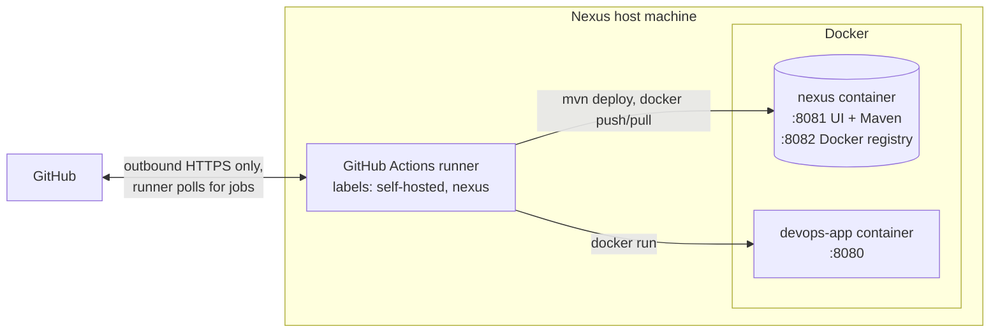

# Setup: Nexus Host Machine

The complete procedure for preparing the machine that runs Nexus, the GitHub Actions self-hosted runner, and the deployed app. Each step lists its purpose, the commands for each operating system, the expected result, and known failure causes.

Everything in steps 3–5 (Nexus start, configuration, registry login, publishing) has been verified end to end on a fresh Linux machine by the workflow `.github/workflows/nexus-setup-test.yml`. The verified run is `37945141137`. Steps 1, 2, 6 and 7 depend on the host machine and have not been run by the project yet.

Background on why these parts exist: [`ARCHITECTURE.md`](ARCHITECTURE.md). Names and values used below: section 4 of [`HANDOFF.md`](HANDOFF.md).

---

## What the machine ends up running



## Requirements

| Item | Requirement |
|---|---|
| OS | Windows 10/11 (with WSL 2), macOS, or Linux |
| Memory | Nexus measured at about 1.2 GB with this project's settings. Docker, the runner, the app (~300 MB) and the OS come on top. A machine with 8 GB total and about 3 GB free while running is a comfortable minimum. |
| Disk | About 3 GB for the images, plus Nexus data |
| Ports free | 8081, 8082, 8080 |
| Network | Outbound internet access. No inbound ports are needed. |
| GitHub access | The repository owner or an admin of the repository is needed for steps 6 and 7 (secrets and runner registration). |

---

## Step 1: Install Git, Docker and the GitHub CLI

**Purpose:** Docker runs Nexus and the app. Git fetches the repository. The GitHub CLI (`gh`) sets secrets from the terminal; it's optional, because the web UI works too.

| OS | Install |
|---|---|
| Windows | `winget install Git.Git Docker.DockerDesktop GitHub.cli`. Docker Desktop needs WSL 2 (`wsl --install`, then reboot). Git for Windows includes **Git Bash**, which runs the project's `.sh` scripts. |
| macOS | `brew install git gh` and `brew install --cask docker`, then open Docker Desktop once |
| Linux (Debian/Ubuntu) | Docker Engine with the Compose plugin from https://docs.docker.com/engine/install/, then `sudo usermod -aG docker $USER` and log out and in again. Also `sudo apt install git gh curl`. |

**Expected result:**
```
docker run --rm hello-world     -> prints "Hello from Docker!"
docker compose version          -> prints a version
git --version
```

**Known failures:**
- `docker: command not found` or `cannot connect to the Docker daemon`: Docker Desktop is not started (Windows/macOS), or the user is not in the `docker` group (Linux; log out and in after `usermod`).

---

## Step 2: Get the repository

```bash
git clone https://github.com/manaymehta/devops-nexus-pipeline.git
cd devops-nexus-pipeline
```

If the repository was transferred to another account, the URL contains that account name instead. GitHub also redirects the old URL.

**Expected result:** the folders `app/`, `infra/nexus/`, `docs/` and `.github/workflows/` exist.

---

## Step 3: Start Nexus

```bash
cd infra/nexus
docker compose up -d
```

**What happens:**
- Docker downloads `sonatype/nexus3:3.96.4` (about 480 MB, first time only).
- It starts the container `nexus` with a 1 GB Java heap.
- It stores all Nexus data in the Docker volume `nexus-data`, which survives restarts and `docker compose down`.

**Expected result:**
- `docker ps` lists `nexus` as `Up`.
- After 1–3 minutes, http://localhost:8081 shows the Nexus web UI.
- Configuration happens in step 4, so the UI's first-run wizard can be left alone.

**Known failures:**
- `port is already allocated`: something else uses 8081 or 8082. It shows up with `netstat -ano | findstr :8081` (Windows) or `lsof -i :8081` (macOS/Linux).
- The container keeps restarting: `docker logs nexus` usually shows an out-of-memory error, meaning too little free RAM.

---

## Step 4: Configure Nexus

**Purpose:** `infra/nexus/setup-nexus.sh` performs the whole Nexus configuration through its REST API, instead of clicking through the UI. It is safe to run again: each part checks whether it's already done.

```bash
# still in infra/nexus
cp .env.example .env
```

Then edit `.env`:

| Variable | Meaning |
|---|---|
| `NEXUS_ADMIN_PASSWORD` | New password for the Nexus `admin` account |
| `NEXUS_CI_PASSWORD` | Password for the `ci` account the pipeline uses. The same value becomes the GitHub secret `NEXUS_PASSWORD` in step 6. |
| `NEXUS_ACCEPT_EULA` | `yes` after reading https://links.sonatype.com/products/nxrm/ce-eula. Nexus Community Edition is free, but it refuses to store or serve anything (HTTP 403, even for admin) until its licence is accepted. |

Passwords must not contain `"` or `\`. `.env` is git-ignored and never committed.

Run the script with bash. On Windows, use **Git Bash**, not PowerShell or cmd:

```bash
bash setup-nexus.sh
```

**Expected output:**
```
==> Waiting for Nexus at http://localhost:8081 (first start can take a few minutes)
==> Nexus is ready
==> Admin password changed
==> EULA accepted
==> Docker Bearer Token Realm activated
==> Anonymous access already disabled
==> Repository docker-hosted created (HTTP connector on port 8082)
==> Role ci-deployer created
==> User ci created

Nexus is configured.
```

A second run prints `already ...` for each line.

**What now exists in Nexus:**

| Item | Purpose |
|---|---|
| `maven-releases` (built in) | Final versions such as `1.0.0`. Re-uploading an existing version is rejected. |
| `maven-snapshots` (built in) | Work-in-progress `-SNAPSHOT` builds, which can be overwritten |
| `docker-hosted` (created) | Docker images, served as a registry on port 8082 |
| Role `ci-deployer` | Read/write on those three repositories, nothing else |
| User `ci` | The account the pipeline logs in with |

**Known failures:**

| Symptom | Cause |
|---|---|
| `$'\r': command not found` | The script was checked out with Windows line endings. The repository's `.gitattributes` prevents this for fresh clones. For a clone made before that file existed: `git pull`, then `rm infra/nexus/setup-nexus.sh && git checkout -- infra/nexus/setup-nexus.sh`. |
| `admin login failed and /nexus-data/admin.password is gone` | The admin password was changed earlier to something other than `NEXUS_ADMIN_PASSWORD`. Either put the current password in `.env`, or reset Nexus completely with `docker compose down -v` (deletes all Nexus data) and start again from step 3. |
| `ERROR: Nexus Community Edition requires accepting its End User License Agreement` | `NEXUS_ACCEPT_EULA` is not `yes`. |
| Repository requests answer 403 with a message about the EULA | Same cause: EULA not accepted. |

---

## Step 5: Verify the registry and Maven repositories

```bash
docker login localhost:8082 -u ci          # password: NEXUS_CI_PASSWORD
```

**Expected result:** `Login Succeeded`.

Docker allows plain-HTTP registries on `localhost` without extra configuration. A registry on any other host name or IP would need HTTPS or an `insecure-registries` entry in Docker's daemon settings, which this project avoids by always using `localhost` from the host itself.

Optional publish test from the host. It needs JDK 21, which the self-hosted runner later downloads by itself:

```bash
cd app
NEXUS_USER=ci NEXUS_PASSWORD=<NEXUS_CI_PASSWORD> ./mvnw -s ci-settings.xml deploy -DskipTests
```

**Expected result:** `BUILD SUCCESS`. The jar then appears in the Nexus UI under Browse → `maven-snapshots` → `com/devops/devops-app`.

---

## Step 6: Store the Nexus credentials as GitHub secrets

**Purpose:** workflows read the `ci` login from encrypted repository secrets, so it never appears in code or logs.

**Who:** the repository owner, or an admin of the repository. On a personal-account repository, collaborators cannot manage secrets.

With the GitHub CLI, from inside the cloned repository:

```bash
gh auth login                      # once, if not logged in
gh secret set NEXUS_USER --body ci
gh secret set NEXUS_PASSWORD       # prompts for the value: NEXUS_CI_PASSWORD
```

Or on the web: repository → Settings → Secrets and variables → Actions → New repository secret.

**Expected result:** `gh secret list` shows `NEXUS_USER` and `NEXUS_PASSWORD`.

---

## Step 7: Install the self-hosted runner

**Purpose:** GitHub's cloud machines cannot reach `localhost:8081` on this machine. The runner is a small GitHub program on this machine. It asks GitHub for jobs over an outbound connection and runs them locally, where Nexus and Docker are reachable.

**Who:** registering needs a one-time token. Only the repository owner or an admin can see it. If someone else operates this machine, the owner opens the page below and passes on the token, which expires after one hour.

1. On GitHub: repository → **Settings** → **Actions** → **Runners** → **New self-hosted runner**, then choose this machine's OS and architecture.
2. The page shows exact *Download* and *Configure* commands, including the token. Run them in a folder **outside** the repository, for example `C:\actions-runner` or `~/actions-runner`.
3. During `config.sh` / `config.cmd`, the prompts are:
   - runner group: Enter (default)
   - runner name: Enter (default) or any name
   - **additional labels: `nexus`** (`self-hosted` is added automatically)
   - work folder: Enter (default)
   - On Windows, *"run as service?"*: **N**. A runner started from the user's own terminal can use Docker Desktop. A service account typically cannot.
4. Start the runner:

   | OS | Command (in the runner folder) |
   |---|---|
   | Windows | `.\run.cmd` |
   | macOS / Linux | `./run.sh` |

   The terminal stays open while the runner works. Closing it stops the runner. On Linux it can be installed as a service instead: `sudo ./svc.sh install && sudo ./svc.sh start`. The service user then needs to be in the `docker` group.

**Expected result:** the terminal prints `Listening for Jobs`, and the runner shows as **Idle** under Settings → Actions → Runners, with labels `self-hosted`, `nexus` and the OS.

**Windows-specific notes** (not yet verified on a real Windows runner in this project):
- Workflow steps for the self-hosted runner are written with `shell: bash`. On Windows the runner uses the first `bash` found on `PATH`. `where bash` in cmd shows the order. If `C:\Windows\System32\bash.exe` (WSL) comes before `C:\Program Files\Git\bin\bash.exe`, steps run inside WSL, where Docker and paths differ. Putting `C:\Program Files\Git\bin` earlier in the user `PATH`, then restarting the runner, avoids this.
- `curl` is built into Windows 10/11.

---

## After setup

With steps 1–7 done, the remaining project work is the release and deploy workflows described in sections 6.4 and 6.5 of [`HANDOFF.md`](HANDOFF.md). `.github/workflows/nexus-setup-test.yml` already performs every command those workflows need (version set, `deploy` with `ci-settings.xml`, jar download from Nexus, image build from that jar, push, pull, run, version check), so it is a working reference for them.

## Everyday commands on the host

| Purpose | Command |
|---|---|
| Stop Nexus (keeps data) | `cd infra/nexus && docker compose down` |
| Start Nexus again | `cd infra/nexus && docker compose up -d` |
| Nexus logs | `docker logs -f nexus` |
| Memory use | `docker stats --no-stream` |
| Delete Nexus and **all** stored artifacts | `cd infra/nexus && docker compose down -v` |
| Running app version | `curl http://localhost:8080/api/version` |
